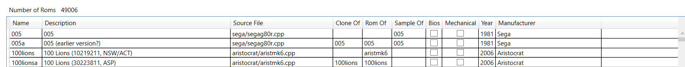

# Starting without db
You can:
- Populate Temp: 

# Populate Temp
## Load XML
Select an XML file containing ROM data; it will load and parse it, then display the results in a grid.

After it, you can save:
- The content to a sqlite database to populate it => table `TempRoms` (MyMameHelper create it)
- Build:
    - Constructeurs[^inc]
    - Genres[^inc]
    - Machines (model1, model2)[^Mach]

[^inc]: Il en manque, voir pourquoi
[^Mach]: Je n'ai pas vu de cps, mais ça vient peut être du set que j'ai employé

 

# Compare
# Copy all Games
# Move all Games
# DbTools
You can create an empty database here.

 

# FAQ
## What happens if i want to add some games
Currently you can add new games by feed with load XML the data base. You don’t have to populate it all at once.

## What happens if i save over a non empty database
You will be notified about constraint violations if some data already exist[^violation]. 

[^violation] peut être sortir sur un système récapitulatif en fin, car actuellement c'est assez pénible.